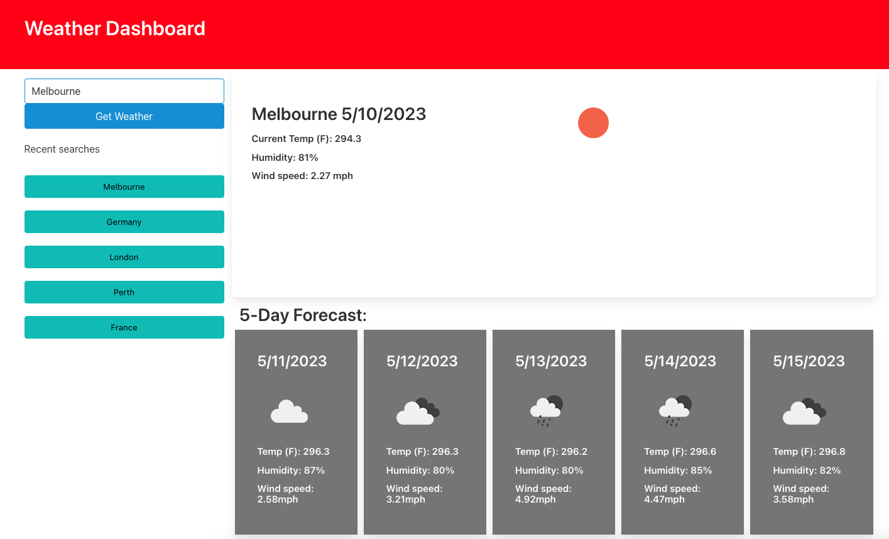

# Weather Dashboard

Weather dashboard app that runs in the browser and features dynamically updated HTML and CSS, as well as OpenWeather API.

## Deployment Link

https://natasa00.github.io/WeatherDashboard/

## Technologies used for this project

- JavaScript
- CSS
- HTML
- OpenWeather API

## Description

When user clicks search button for a particular city, the app shows current and future conditions for that city and that city is added to the search history. Once the current weather conditions for that city are shown, then user is presented with the city name, the date, an icon representation of weather conditions, the temperature, the humidity, and the wind speed. When future weather conditions for a particular city are displayed, the representation of 5-day forecast that displays the date, an icon representation of weather conditions, the temperature, the wind speed, and the humidity, is shown. Additionally, when user clicks on a city in the search history, the current and future conditions for that city, are presented.

